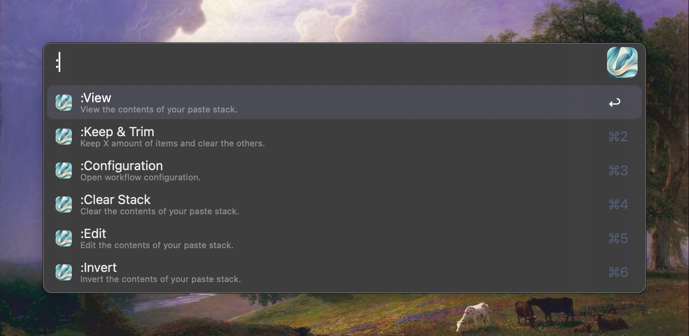
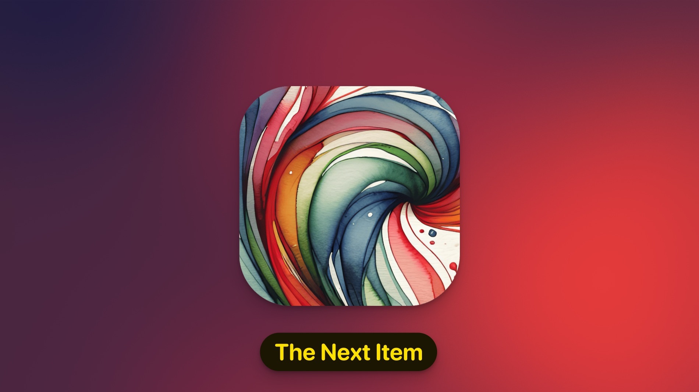

<h1 align="center">PASTEFLOW</h1>
<p align="center"><strong>A Paste Stack & Paste Queue for Alfred | Pin & Reuse Text</strong></p>
<p align="center">
  <a href="https://youtu.be/2TWJGcTVy3A">
    
  </a>
</p>
<p align="center"><em><a href="https://youtu.be/2TWJGcTVy3A">~ Video Overview & Setup ~</a></em></p>

## WHAT IS PASTEFLOW?
PasteFlow is a handy paste stack (or paste queue) for [Alfred](https://alfredapp.com/). It lets you create a list of pinned text items that you can organize, edit, and use in different ways.

Ever needed to copy text from various places and put it all in one final spot? PasteFlow makes this easy. No more switching back and forth to copy and paste one item at a time. Save time and stay *in flow* by doing all your copying first, then pasting later when you're ready. Since your items are saved in an actual list, you can even take a break, copy other things, and come back to your stack whenever you want.

Thanks to Alfred's triggers, clipboard features, and actions, PasteFlow is a flexible tool that can boost your productivity when working with text.

---
## REQUIREMENTS

* This workflow uses Alfred’s Clipboard History. You do not need to use Alfred as your main clipboard manager, but you must have this feature activated.

---
## HOW TO USE PASTEFLOW?
If you're already familiar with paste stacks, you can start using PasteFlow right away with its default settings. Here's how to get started:

1. **Add items to your stack:**
   - Select text and use Pasteflow actions on them.
   - Set up your preferred hotkeys (green color-coded hotkeys are the most basic/essential).
   - Use PasteFlow's keyword to add items from your Clipboard to your stack.
   - Use the `:Add` option in the main menu.

2. **Process your saved items:**
   The easiest way to do this is to set up a hotkey (in green), but you can also use PasteFlow's keyword directly on Alfred's bar.
   - Paste items to your current window
   - Copy items back to your clipboard

3. **View & edit your stack:**
   - Set up hotkeys (red-coded hotkeys show your entire list)
   - Enter "Selective Mode" from Alfred's Bar using PasteFlow's keyword
   - Use Text View Mode (type `:View` with PasteFlow's keyword)

That's all you need to get started! But if you want to explore more, PasteFlow has lots of other useful and powerful features.

<p align="center">
  
</p>

---
## FEATURES

### Configuration
PasteFlow is flexible and adapts to your workflow. Here's how you can set it up:

* **Stack or Queue**: Choose how new items are added - at the top (stack) or bottom (queue). [***Read more about the sorting logic.***](#the-sorting-logic)
* **Processing Order**: Pick where to start processing items - from the top or bottom. It's all about what feels right for you.
* **Selective Processing**: This setting allows for advanced workflows when inserting or processing individual list items. It works together with your chosen processing order. [***Read more about the insertion & processing logic.***](#the-processing-logic)
* **Auto-Clear Options**: Decide if you want items cleared after processing. You can set this for individual items or the entire list when processed at once. [***Read more about ways to clear your items.***](#clearing-items)
* **Restart or Stop**: Choose whether to restart processing when you reach the end of your list, or simply stop until you add more items.
* **Paste Actions**: Optionally, add a line break, comma, space, or press tab after each pasted item from your list.
* **Merge Formatting**: When processing your entire list at once, choose to merge items with line breaks, commas, or spaces.
* **List Lifespan**: Use PasteFlow as a temporary list with a timeout, or keep it indefinitely. For long-term lists, there's a custom save directory.

### In Action
PasteFlow is packed with features to make your workflow smoother:

* **Large Text View**: In the main menu, press CMD L on any item to see your list in large text. You can also copy it (CMD C) or use Alfred's universal actions on it.
* **Selective Mode Viewing**: In Selective Mode, CMD L shows the full content of an item. Copy or use universal actions here too.
* **Hidden Menu**: Type `:` in Alfred's bar (with PasteFlow's keyword) to reveal extra options like inverting your list order, clearing it, or editing all its raw contents. Many of these are also directly available in Text View Mode (`:View`). [***Read all about the main menu.***](#the-main-menu)
* **Powerful Selective Mode**: Edit individual items, move them around, remove them, or process them in any order. Some modifier combos let you tweak the whole list without entering Text View Mode. [***Read all about Selective Mode.***](#selective-mode)
* **Multi-line Splitting**: Select a multi-line text and automatically split it into individual PasteFlow items. [***Read all about Universal Actions***](#universal-actions)
* **Multiple Control Methods**: Use Alfred's bar directly, keyboard shortcuts ([color-coded for easy remembering](#custom-hotkeys)), or send arguments to the external trigger. [***Read all about the external trigger.***](#the-external-trigger)
  
PasteFlow is designed to be a flexible & powerful clipboard companion. Whether you're a pro or just getting started with paste stacks and clipboard managers, it's here to make your copy/paste tasks more efficient. Feel free to read below for more detailed information on all the features, and do not forget to [check out some tips and ideas that you may also find useful.](#closing--tips)

<p align="center">
  
</p>

---
## CLEARING ITEMS

You can use PasteFlow as a temporary text holder or a more permanent list. Here's how you can clear items from it:

<details>
  <summary><b>👇️ Auto-Clearing the List</b></summary>

*PasteFlow offers easy configuration options for automatic clearing:*

* **Timeout**: Set a time limit for your list.
* **Clear Item After Processed**: Remove items once you've used them.
* **Clear List After Processed**: Wipe the entire list after processing all items at once.
</details>

<details>
  <summary><b>👇️ Manually Clearing the List</b></summary>

*If you want to have control of where, how, or when your items are cleared, you have these manual options:*

* **Clear and Add**: In the main menu, hold CMD while selecting 'Add to List from Clipboard' or 'Split & Add to List'. This clears the list before adding new items.
* **Main Menu Option**: Type `:Clear` in the main menu.
* **Hotkey**: Set up a keyboard shortcut (yellow color-coded) to clear your list.
* **In Text View Mode**: In Text View Mode (`:View` from main menu), use CMD + CTRL + OPT + Return.
* **In Selective Mode**: 
  - Clear individual items: Hold CTRL while pressing return (items are removed, not pasted or copied)
  - Clear entire list: Use CTRL + CMD + Return
* **External Trigger**: Use the `clearList` argument to clear the list. You can also set a second argument to `1` to clear the list before adding new items.
</details>

---
## THE MAIN MENU
The main menu is your control center for PasteFlow. Here's some things you can do without even actioning any menu option:

* See your list in large text with CMD L
* Copy your entire list at once with CMD C
* Use Alfred's Universal Actions on your full list

*Note: Pasteflow's menus are populated dynamically. For example, you won't see some processing options if your list is empty, the "Next Item" processing option won't be available if all items have been processed and the list isn't set to restart, or you will not have the "insert in next position" modifier [if it makes no difference](#advanced-insertion-and-processing)...*

<details>
  <summary><b>👇️ Main Menu Options and Modifiers</b></summary>

* Add to Stack/Queue from Clipboard
  * CMD: Start fresh by clearing the list before adding
  * OPT: Add only what's currently in your clipboard
  * CMD + OPT: Clear the list and add only the current clipboard item
  * CTRL: Insert a range of clipboard items in the "next" position
  * CTRL + OPT: Add current clipboard item inserting it in the "next" position
  * FN: Add manually from recent clipboard items (select to add).
  * CMD + FN: Add manually from recent clipboard items (select to add). Clear before adding.
  * CTRL + FN: Add manually from recent clipboard items in "next" position.

* Split & Add to Stack/Queue
  * CMD: Clear the list before adding new items
  * OPT: Flip the order of your split clipboard before adding
  * OPT + CMD: Clear the list and add your split clipboard in reverse order
  * CTRL: Split current clipboard by newlines and insert in "next" position
  * CTRL + OPT: Split current clipboard by newlines, flip the order, and insert in "next" position

* Next Item (Pastes by Default)
  * CMD: Copy the next item instead of pasting
  * OPT: Paste the next item, but reverse the usual processing order
  * CMD + OPT: Copy the next item, but reverse the usual processing order

* Merge & Process your Entire Stack/Queue (Pastes by Default)
  * CMD: Copy your whole list instead of pasting
  * OPT: Paste your entire list in reverse order
  * CMD + OPT: Copy your entire list in reverse order

* Selective Processing (Pastes by Default)
  * CMD: Copy items instead of pasting

* Merge & Process Clipboard (Pastes by Default, Follows Stack/Queue Order)
  * CMD: Copy merged items instead of pasting
  * OPT: Paste merged clipboard items in reverse order
  * CMD + OPT: Copy merged clipboard items in reverse order

</details>

There's also a "secret" menu with extra options for your entire list. Just type `:` to access it. These actions are straightforward and*—with the exception of `:Add`—*don't have modifier combinations.

<details>
  <summary><b>👇️ The "Secret" Menu Options:</b></summary>

* Configuration: Adjust your PasteFlow settings
* View Stack/Queue (Text View Mode): See your list in Alfred's Text View
* Clear Stack/Queue: Empty your list
* Edit (Raw Contents of List in Text View Mode): Make changes to your entire list
* Invert: Flip the order of your list
* Keep & Trim (Keep X amount of items): Slim down your list to a specific number of items
* Reset Next Item Index: Start processing from the beginning again
* Add: Manually add items to your paste stack. You can use Text View with the OPT modifier to add multiple items at once (using PasteFlow's bullet)

<p align="center">
  
</p>

</details>

PasteFlow's main menu is designed to give you quick access to all the tools you need. Whether you're adding items, processing them, or managing your list, everything is just a few keystrokes away!

---

## SELECTIVE MODE
Selective mode gives you a hands-on experience with your PasteFlow list. It's like having a traditional paste stack/queue at your fingertips, where you can shuffle items around, make edits, or process them in any order you like. 

If you've set PasteFlow to keep processed items, you'll have some visual cues on the icons that show which item is next in line (an icon with red) and which have already been processed (icons with transparency).

<p align="center">
  
</p>

Just like in the main menu, Selective Mode lets you do a few things with each item:
* See the item in large text with CMD L
* Copy the item with CMD C
* Use Alfred's Universal Actions on any item

<details>
  <summary><b>👇️ Modifier Keys for Item Management</b></summary>

* CMD: Choose between copying or pasting
* OPT: Edit the item
* CTRL: Clear the item
* SHIFT: Move the item up
* FN: Move the item down

</details>

<details>
  <summary><b>👇️ Advanced Modifier Combos</b></summary>

* CMD + OPT: Edit your entire list
* CMD + CTRL + OPT: Clear your whole list
* CMD + FN: Invert the order of your entire list
* FN + SHIFT: Start processing from the beginning again
* CMD + SHIFT: Choose which item to process next (great for advanced insertion or processing)

</details>

Selective Mode puts you in control. It's designed to be intuitive and powerful, giving you the flexibility to work with your list exactly the way you want.

---
## CUSTOM HOTKEYS

<details>
  <summary><b>👇️ The hotkeys have been color-coded to make setup easier for you.</b></summary>

### Green: Essentials & Basics
These are the must-haves for most users. They let you add items to your list, process them, and access the main menu without needing a keyword.

### Red: Full List Views
Two options for seeing your entire list:
* "Selective" mode: Process and edit items one by one
* "Text View" mode: Get a clean overview of your whole paste stack/queue

### Yellow: Handy Extras
Not essential, but nice to have:
* Split selected text and add each line as individual items to your list
* Add a range of recent clipboard items
* Paste next item inline with a snippet
* Quickly clear your list
* Jump to PasteFlow's configuration

### Blue: Custom Workflow Boosters
These are some extra features that are more niche for specific workflows.

### Pink: External Trigger
The external trigger gives you complete control over all of PasteFlow's features.
</details>

If you zoom out in Alfred's workflow editor (CMD + Hyphen), you'll notice the hotkeys are loosely grouped into:
* Insertion actions
* Processing actions
* Full-list actions
* Workflow actions

*Note: PasteFlow offers a lot of processing actions, and when combined with different settings, the preset hotkey list could grow huge. Some features, like inverting inserts or processing, are for more advanced users—so I didn't include those as hotkeys. If you're looking for customization beyond the available hotkeys, I recommend learning to use [the external trigger.](#the-external-trigger)*

---
## PASTEFLOW'S BULLET

PasteFlow uses a special bullet character to separate items in your list. This bullet is essential for the workflow to recognize where each item begins. While it's not easy to type directly (most users won't need to, anyways), **there's a convenient yellow-coded snippet you can set up to quickly insert it when needed.**

<details>
  <summary><b>👇️ This bullet becomes particularly useful when:</b></summary>

1. **Editing in Text View Mode**: Access this mode by:
   - Setting up a custom hotkey
   - Directly using `:Edit` from the main menu
   - Switching from view (`:View` in the main menu) to edit mode using the OPT modifier

2. **Creating or Editing Lists**: Once in Text View Mode, you'll see each item starting with this bullet. You can:
   - Edit existing items
   - Start a new list (if your list is currently empty) by beginning each line with the bullet
   - Add multiple items at once by using bullets to separate them

3. **Adding Items**: When using `:Add` from the main menu:
   - Regular input adds a single item
   - Holding OPT opens Text View Mode where you can add multiple items using bullets

</details>

👉 [Watch Demo Video](https://ishortn.ink/pf110)

While using the bullet isn't always necessary, it's a helpful tool for managing and organizing your list, especially in more advanced workflows.

---
## UNIVERSAL ACTIONS
PasteFlow comes with two powerful universal actions, each with additional modifier options to fine-tune your workflow:

<p align="center">
  
</p>

### Add to List
This action adds your selected text to your PasteFlow list. 

<details>
  <summary><b>👇️ Here's what you can do:</b></summary>

* **Default**: Simply adds the item to your list
* **CMD**: Clears your existing list before adding the new item
* **CTRL**: Forces the new item into the "next" position in your list

</details>

### Split & Add to List
This action splits your selected text into separate items and adds them to your list. It's super handy for multi-line text. 

<details>
  <summary><b>👇️ Here are your options:</b></summary>

* **Default**: Splits and adds items to your list
* **CMD**: Clears your existing list before splitting and adding as new items
* **OPT**: Splits, inverts the order, then adds items (following your queue/stack sorting logic)
* **CMD + OPT**: Clears your list, then splits, inverts, and adds new items
* **CTRL**: Splits and forces insertion of new items into the "next" position
* **CTRL + OPT**: Splits, inverts the order, then forces insertion into the "next" position
  
</details>

These universal actions give you quick, flexible ways to add content to your PasteFlow list, right from any text you're working with.

---
## THE SORTING LOGIC

PasteFlow adapts to your preferred way of organizing information. Here's how it works:
* **Stack**: New items go to the top. Think of it like a pile of plates - the last one you add sits on top.
* **Queue**: New items go to the bottom. It's like people lining up - newcomers join at the end.

But what happens when you add multiple items at once? That's where it gets interesting:
* **Clipboard Items**: Most clipboard managers put recent items at the top. If your PasteFlow is set as a queue, it'll flip this order to match your preference.
* **Split Lists**: When you split a text into individual items, PasteFlow considers how we naturally write - top to bottom. For a stack setup, it'll invert this order.

**Want to change things up? You've got options:**
* While in stack, use the OPT modifier in Alfred's action or the main menu to add split list items with the most recent at the bottom. If you are in queue mode, you can use the same to insert your split items most recent at the top.
* The external trigger has a parameter for this too.

Remember, multiple clipboard items follow the stack or queue sorting logic when inserting. Unlike split items, there’s no extra setting to change this. Keep this in mind when choosing between stack and queue for your workflow.

---
## THE PROCESSING LOGIC

Assuming you already have understood the sorting logic, now let me explain you what the processing order does. Here's a simple breakdown:

### Basic Processing
* **Stack (Top-to-Bottom)**: Newest to oldest
* **Stack (Bottom-to-Top)**: Oldest to newest
* **Queue (Top-to-Bottom)**: Oldest to newest
* **Queue (Bottom-to-Top)**: Newest to oldest

For most users, this is all you need to know. However, if you enjoy using Selective Mode and are interested in processing or inserting items not only at the top or bottom but also in the middle of your list, there are ways to do that.

### Advanced Insertion and Processing

<p>
    
</p>

PasteFlow's Selective Mode and the "Next Item Index" feature work together for more complex list management:

While in Selective Mode, use CMD + SHIFT when selecting an item to set it as the "next item". This item will not be processed and simply change it's icon into a red variation to indicate it is next in line. There's another way you can do this. Processing or clearing an item from anywhere your list will also automatically update the "next item" to be the one **after** the last processed position (you can choose a different setting for this in the configuration). What makes this a bit challenging, is that the "next item" can behave differently depending on your configuration.

<details>
  <summary><b>👇️ Let's break down how this works in different scenarios:</b></summary>

**Stack (Top-to-Bottom)**:
- If you set the "next item" somewhere in the middle of your list, PasteFlow treats all items **above** it as already processed.
- New items will automatically be inserted at the "next item" position, **not at the top of the list**. This is because the sorting logic of the stack & processing order dictate that **the user wants to use the most recent item next.**
- This allows you to continue processing from a specific point in your list, rather than always starting from the top.

**Stack (Bottom-to-Top)**:
- Setting the "next item" in the middle lets you process from that point upwards.
- However, new items are still **added to the top of the list**, maintaining the stack's logic & processing order (where **user wants to process recent items last**).
- To insert items elsewhere, use the "Force Insert in Next" option when adding new items.

**Queue (Bottom-to-Top)**:
- When you set the "next item" anywhere in the list, PasteFlow considers all items **below** it as already processed.
- New insertions and processing will happen at the "next item" position by default (since in a queue, bottom-to-top, **the user expects the most recent items first**).

**Queue (Top-to-Bottom)**:
- In this setup, you're expecting to **process the oldest items first**.
- New items are always **added to the bottom of the queue**, regardless of the "next item" position.
- To insert items elsewhere in the queue, use the "Force Next" option.
  
</details>

Remember, PasteFlow uses visual cues with icon changes to help you understand the state of your list, even though you can't see it in real-time. Getting familiar with these concepts is not essential, but it allows you to leverage PasteFlow's full potential.

*Important. Note that the actions that modify the contents of your list (most of the options in the "secret" menu) will reset the "Next Item Index" regardless of the "Selective Processing" behavior set in the configuration.*

---
## THE EXTERNAL TRIGGER

The external trigger in PasteFlow allows you to use every feature without sacrificing a single keyboard shortcut. Whether you're using Keyboard Maestro, BetterTouchTool, or other 3rd party apps, you can trigger PasteFlow actions using AppleScript or Alfred's URL scheme by sending arguments.

The external trigger is `cmd` and can receive 4 arguments, comma-separated (without spaces):

```
theAction,clearList,invertOrder,insertNext
```

Only `theAction` is required. 

<details>
  <summary><b>👇️ theAction Options</b></summary>

| Argument Content      | Description                                                  |
|-----------------------|--------------------------------------------------------------|
| `inputAddClipRange`   | Input a number of clipboard items to insert in your list     |
| `!addCurrentClip`     | Add current clipboard to your list (Use `c!` prefix to trigger CMD + C first) |
| `!addSplitClip`       | Split current clipboard by newlines and add as individual items (Use `c!` prefix to trigger CMD + C first) |
| `inputManual`         | Add manually by typing in Alfred's bar                      |
| `textEditManual`      | Add manually using Text View (you can add multiple items at once)       |
| `inputPasteClipRange` | Input a number of clipboard items to merge and paste (doesn't affect stack/queue) |
| `inputCopyClipRange`  | Input a number of clipboard items to merge and copy (doesn't affect stack/queue) |
| `pasteNext`           | Paste the item in "next" position                            |
| `copyNext`            | Copy the item in "next" position                             |
| `pasteStack`          | Merge and paste your entire list                             |
| `copyStack`           | Merge and copy your entire list                              |
| `inputPasteItem`      | Open "Selective View" with paste as default                  |
| `inputCopyItem`       | Open "Selective View" with copy as default                   |
| `config`              | Open PasteFlow's configuration                               |
| `viewStack`           | Open your list in Text View Mode                              |
| `clearList`           | Clear your list                                              |
| `textEditListX`       | Edit the raw contents of your list                           |
| `invert`              | Invert the order of items in your list                       |
| `inputKeep`           | Input a number of items to keep                              |
| `resetNext`           | Reset the index of your "next" item back to 1                |
| `clipFilter`          | Add manually from recent clipboard items                     |

</details>

### Additional Arguments

<details>
  <summary><b>👇️ These arguments need to be `0` for false, or `1` for true:</b></summary>


| Argument | Description |
|----------|-------------|
| `clearList` | Clear your stack/queue before adding items (Use with `inputAddClipRange`, `!addCurrentClip`, and `!addSplitClip`) |
| `invertOrder` | Process list in opposite direction of configuration setting (Affects `pasteNext`, `copyNext`, `inputCopyClipRange`, `inputPasteClipRange`, `pasteStack`, `copyStack`, `!addSplitClip`) |
| `insertNext` | Force insertion of items in the "next" position |
</details>

Remember the `invertOrder` argument doesn't affect adding a range of clipboard items to your list. It's recommended to set your list behavior to match this and customize the rest as needed.

Here’s how some commands would look in action:
* `c!!addCurrentClip,0,0,1` will copy selected text and force insert it in the “next” position. It’s useful to have as an option if your list behaves as “queue” and you are processing it top-to-bottom.
* `pasteNext,0,1,0` will paste the previous item instead of the next one.
* `c!!addSplitClip,1` will copy selected text, split it by newlines, clear your current list, and insert it the split items in a new one.

---
## Closing & Tips

Phew! Thank you for making it this far. After diving into this project, I've got a whole new respect for clipboard manager developers. Who knew the processing and sorting logic for a simple paste stack would turn into such a beast? But hey, that complexity opened up a world of cool options.

<details>
  <summary><b>👇️ Here are some tips/ideas you may find useful:</b></summary>

* PasteFlow plays really nicely with [Alfred's clipboard manager](https://www.alfredapp.com/help/features/clipboard/). I'm always using the clipboard merging feature to grab multiple items and toss them into my list (as split items) all at once.

* Alfred's snippets feature also opens up some more possibilities. You can stash your current stack on your clipboard, save it as a snippet, clear your list, start a fresh one, and then bring back your old items from the snippet later on.

* I love using PasteFlow with [Quill](https://github.com/zeitlings/alfred-quill). It's an awesome workflow that with lets you process your list or individual items with transformations. You can this directly from Alfred's bar, sending your list or items with Alfred actions to Quill before pasting.

* There's this fantastic [Sequential Paste](https://alfred.app/workflows/vitor/sequential-paste/) workflow that partly inspired PasteFlow. I still use it when I need to paste something I thought was on my clipboard, but turns out it's one item behind.

* Here's an idea that I haven't had the chance to put into practice: use that custom path feature for your stack to save it in your Shortcuts folder. Then you could whip up a Shortcut to view, edit, or add items right from your phone. This basically would mean having a cross-platform paste stack.

* I've got to give a shout-out to [CleanClip's](https://cleanclip.cc/) paste stack/queue. It's the only one I've seen that can be both a stack and a queue, and it sparked the idea of adding split lists as individual items.
</details>

Now, I know PasteFlow isn't perfect. You can't see your stack/queue in real-time while processing, and it doesn't keep rich text formatting (that's an Alfred's Clipboard Manager limitation). I know I am biased but I've got to say, I think PasteFlow is pretty good and should hit the spot for most users, whether you're just dipping your toes in or diving into the deep end.

If PasteFlow's making your life easier, how about [buying me a coffee](https://www.buymeacoffee.com/afadingthought)? I'd be over the moon grateful!